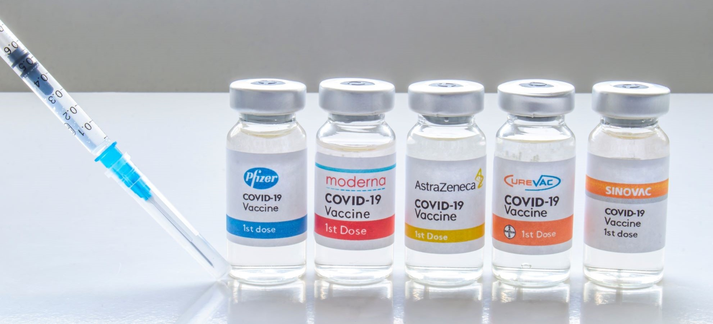

# Project #2: Extract, Transform, and Load

## Group members: 
* Arshad Sheikh
* James Lilley
* Jessica Uppal
* Muhammad Amjad

## Sources of Data:
* country_vaccinations_by_manufacturer.csv (COVID-19 World Vaccination Progress | Kaggle)

https://www.kaggle.com/gpreda/covid-world-vaccination-progress

* vaccine_stocks.csv (COVID-19 Vaccine Companies: Stock Data | Kaggle)

https://www.kaggle.com/akpmpr/covid-vaccine-companies-stock-data-from-2019

## Type of final production database
PostgreSQL

## Plan
The project will be focussing on two different sources of data on Covid-19: Vaccinations by Manufacturers, and Vaccine Stocks. Data will be extracted from both Kaggle datasets and transformed in Jupyter notebook. The transformed data will then be loaded into the PostgreSQL database. 

## Goal of the ETL 

The goal of this project is to produce a dataset which can utilised in further research by data analysts, who may be exploring production of COVID-19 Vaccines by individual manufacturers, and the effect this had on their company's stocks and consequently their success. Specific areas of application for a data analyst could include: 

* Whether the location vaccines are being supplied to have an effect on the manufacturer's stock price. 
* If the volume of vaccines being supplied over time can be correlated to a vaccine manufacturer's stock price. 
* Potential relationships between the total vaccines supplied and the average stock value of all vaccine manufacturers. 

