# Project #2: Extract, Transform, and Load
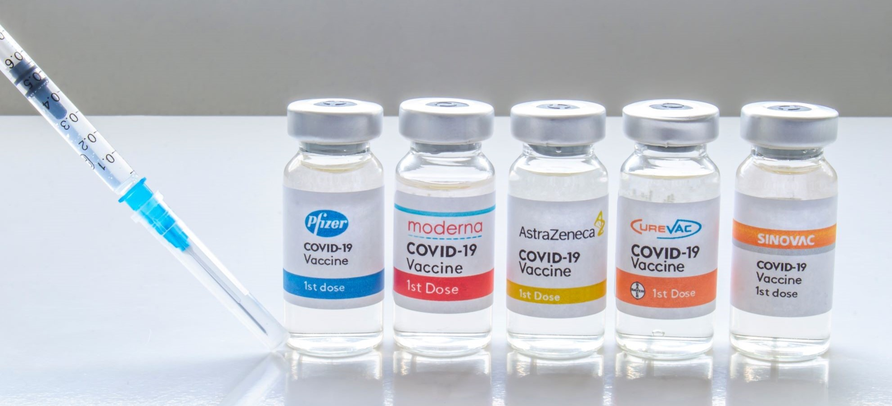

## Contents

* [Project Proposal](#Project-header)
* [Goal of the ETL](#Goal-header)
* [Sources of Data](#Sources-header)
* [Required Setup](#Required-header) 
* [Data Extraction](#Extraction-header)
* [Data Transformation](#Transform-header)
* [Data Loading](#Load-header)
* [Collaborators](#Collaborators-header)

## Project Proposal
The project focuses on the current topic of COVID-19 vaccinations. The chosen dataset’s have been extracted from two different sources of data: Vaccinations by Manufacturers, and Vaccine Stocks. The data transformation process will be performed using Jupyter Notebook, and then be loaded into a PostgreSQL database preparing the data for further analysis to be performed.

## Goal of the ETL

The goal of this project is to produce a dataset which can utilised in further research by data analysts, who may be exploring production of COVID-19 Vaccines by individual manufacturers, and the effect this had on their company's stocks and consequently their success. Specific areas of application for a data analyst could include: 
* Whether the location vaccines are being supplied to have an effect on the manufacturer's stock price. 
* If the volume of vaccines being supplied over time can be correlated to a vaccine manufacturer's stock price. 
* Potential relationships between the total vaccines supplied and the average stock value of all vaccine manufacturers. 

## Sources of Data

Our dataset contains two CSV files available from [Kaggle.com](https://www.kaggle.com). Both CSV’s are located in the [resources](resources/) folder:

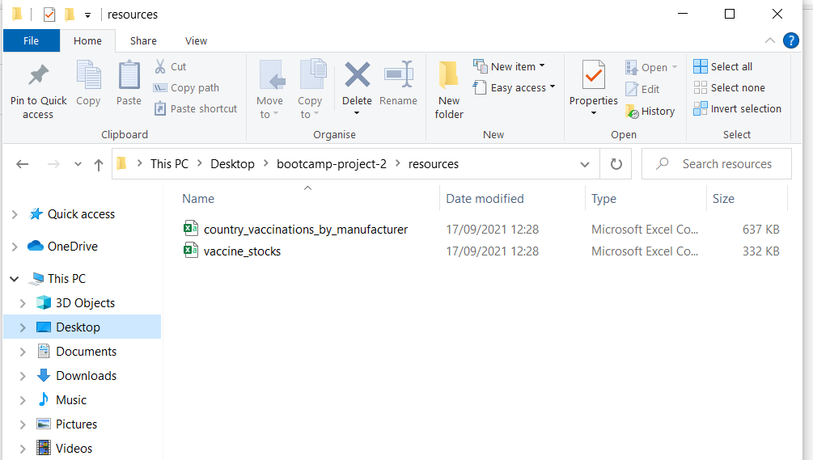
* The country_vaccinations_by_manafacturer CSV is from the [COVID-19 World Vaccination Progress](https://www.kaggle.com/gpreda/covid-world-vaccination-progress) dataset.
* The vaccine_stocks CSV is from the [COVID-19 Vaccine Companies: Stock Data](https://www.kaggle.com/akpmpr/covid-vaccine-companies-stock-data-from-2019) dataset.

## Required Setup

To run the notebook.ipynb file you will need to install the following packages/dependencies:
* SQLAlchemy `pip install SQLAlchemy`
* SQLite `conda install -c anaconda sqlite -y`
* Psycopg2 `pip install psycopg2`

To connect to the PostgreSQL database you will need to add your PgAdmin 4 username and password to a config.py file
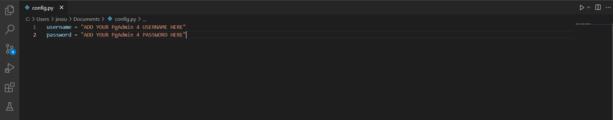
The config.py file should be stored in your local repository folder.

## Data Extraction

Two files are selected from Kaggle.com and both files are csv format.
Both files are converted to panda DataFrams.

Dataframes are named as manufacturer and stocks_df.
All the columns are listed for both Dataframes.
manufacturer columns are following

(['location', 'date', 'vaccine', 'total_vaccinations']

stocks_df columns : 

['Date', 'High_BioNTech', 'Low_BioNTech', 'Open_BioNTech',
       'Close_BioNTech', 'Volume_BioNTech', 'Adj Close_BioNTech',
       'High_Moderna', 'Low_Moderna', 'Open_Moderna', 'Close_Moderna',
       'Volume_Moderna', 'Adj Close_Moderna', 'High_Johnson & Johnson',
       'Low_Johnson & Johnson', 'Open_Johnson & Johnson',
       'Close_Johnson & Johnson', 'Volume_Johnson & Johnson',
       'Adj Close_Johnson & Johnson', 'High_Inovio Pharmaceuticals',
       'Low_Inovio Pharmaceuticals', 'Open_Inovio Pharmaceuticals',
       'Close_Inovio Pharmaceuticals', 'Volume_Inovio Pharmaceuticals',
       'Adj Close_Inovio Pharmaceuticals', 'High_Sinovac', 'Low_Sinovac',
       'Open_Sinovac', 'Close_Sinovac', 'Volume_Sinovac', 'Adj Close_Sinovac',
       'High_Sinopharm', 'Low_Sinopharm', 'Open_Sinopharm', 'Close_Sinopharm',
       'Volume_Sinopharm', 'Adj Close_Sinopharm', 'High_Novavax',
       'Low_Novavax', 'Open_Novavax', 'Close_Novavax', 'Volume_Novavax',
       'Adj Close_Novavax', 'High_Astrazeneca', 'Low_Astrazeneca',
       'Open_Astrazeneca', 'Close_Astrazeneca', 'Volume_Astrazeneca',
       'Adj Close_Astrazeneca']
      
All the columns are checked to
ensure the dates and vaccine manufacturer names in each table match so that the tables can be joined.

## Transformation

Now that we have established that both of our dates used the same format and who our mutual vaccine manufacturers are, we used the rename function to change the names of the vaccines in the manufacturer. 
We chose to rename them in the manufacturer and not the stocks_df as the vaccine names were easier to read. 

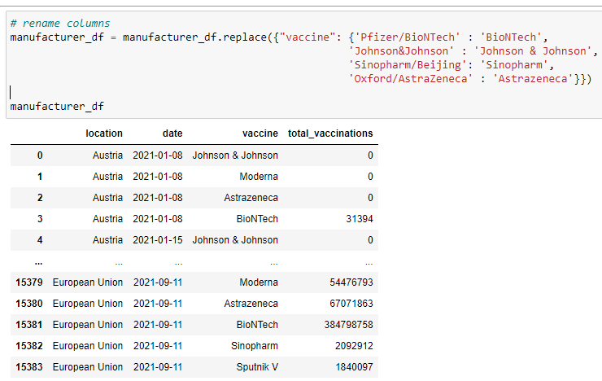

The challenge we faced in the stocks_df was that the names of each vaccine supplier and the stock value was stored in columns, as opposed to rows. 
We needed to devise a way to take the values from the columns, and insert them into rows. 
At which point we could join this information back with the manufacturer to show the total number of vaccines in a given location on a single row.

Our first step was to create a new list of lists, this list of lists was created through a nested loop. 
We extracted the name of each vaccine, stock type and value from their respective columns on a row and added the date

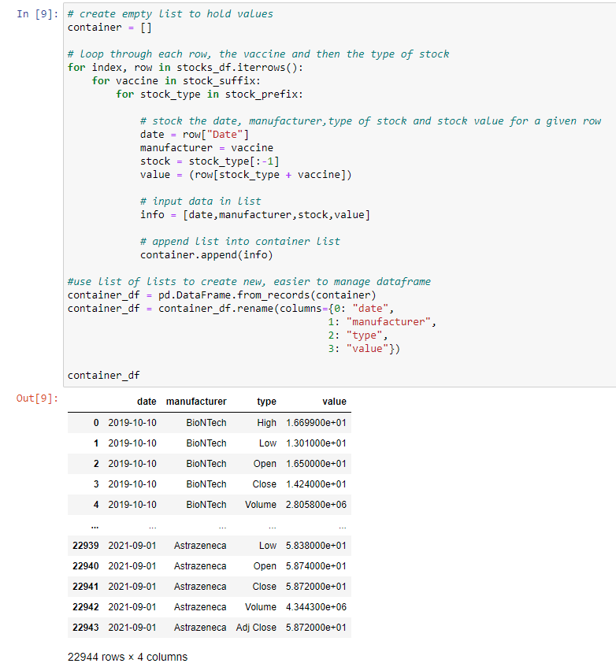

Now that this was completed, our data was easier to work with. 
At this point, a mathematical check was conducted to see if each vaccine was present on each date in the dataset. 
To ensure no data was misplaced or lost during any further transformations. 

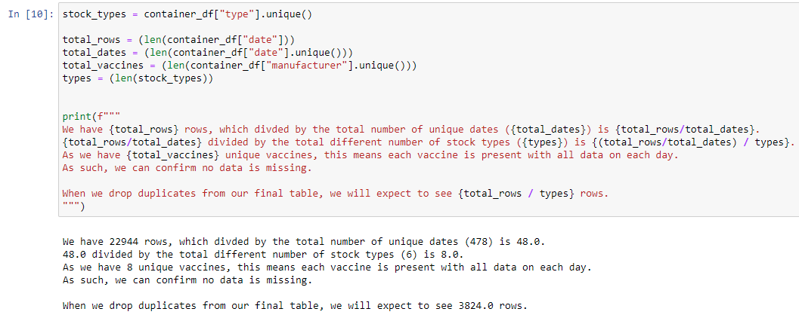

Now we could take this data where the stock type is stored in rows and move it back into columns which store the stock value. 

We began by placing all of the dates and manufactures into a new dataframe and filtering for one of our six stock types. 
This filtered dataframe would then be joined with our new empty dataframe. 
We ran the operation with a single stock value as a proof of concept. 

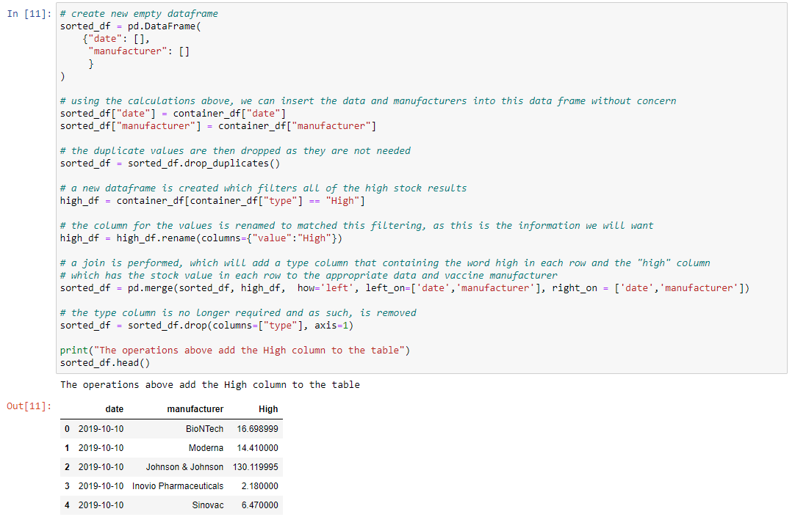

Now that we could see this achieved the desired result, we perform the operation with each of the stock types. 

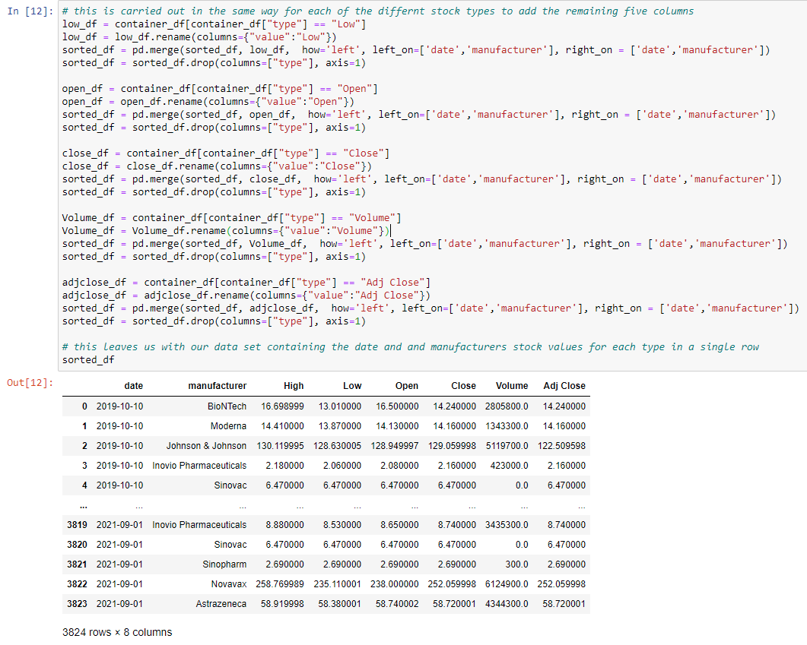

To finish our transforming, we have to bring both of our dataframes, our stocks_df now named 'sorted_df' and the manufacturer_df. 

This was completed using a join and dropped both the duplicate rows as well as rows containing NaN values. 

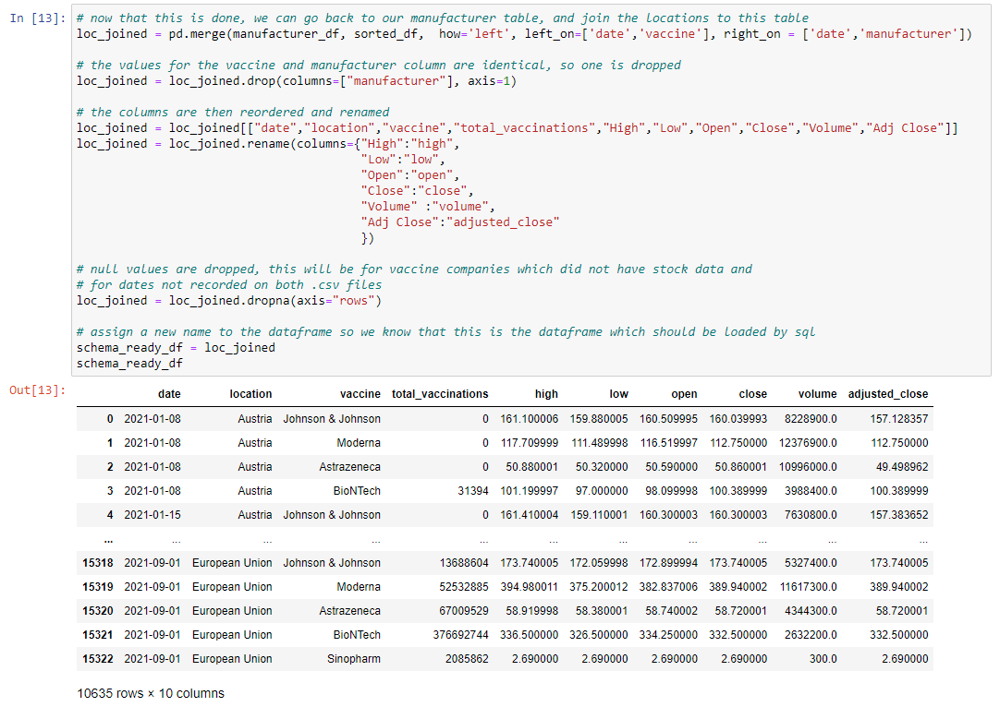

Rows either contained NaN values due to: 

* The date ranges of both datasets not being mutual. 
* A vaccine not being present on both sources of data. 

We appreciate that this drops a lot of data, however, we are only dropping data which would not be used in the analysis we anticipate our data to be used for. 

Ultimately, we are still left with over a year's worth of data for multiple vaccine manufacturers and feel this is sufficient. 
We could consider not dropping this data in future and leaving it to the analyst to make that decision - if they for example wanted to see vaccines produced in a country which weren't necessarily tracked by stocks.
As this may have had an effect on the stocks of one of our vaccines manufacturers, we do have recorded stock data for. 
For example, if both manufacturers were competing for a location, their stock prices may be affected by the other. 

Now that we have finished our transformation, we could now begin loading this data into SQL.

## Data Loading

‘pgAdmin 4’ was used to create a PostgreSQL table that included the headers (table names) from the dataframe. 

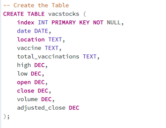

A localhost connection to a PostgreSQL server was created and a connection made to it. The *connection* was made via an *engine* on *Jupyter Notebook* that could talk to the *database*.

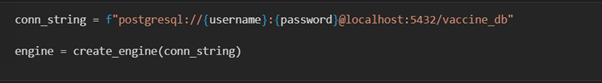

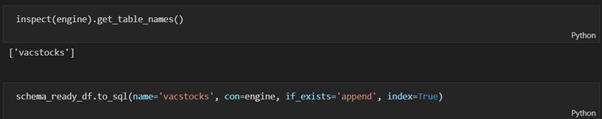

A PostgreSQL query was then created on ‘pgAdmin 4’ to populate the table with the imported CSV datasets confirming the connection and successful importation of data.

## Collaborators

* [Arshad Sheikh](https://github.com/ashsams18)
* [James Lilley](https://github.com/jimbleslilley)
* [Jessica Uppal](https://github.com/JessicaUppal)
* [Muhammad Amjad](https://github.com/amjad5050)

##  Project Work Day 1
on first day all the members did the brainstorming to finalize the project and choose the csv files.
Arshad wrote the project proposal as group decided one person to write and rest take part in dictation.
## Project Work Day 2
Again, group decided one person will take the responsibility and that was James. All other members took part on plan of execution.
Data was converted, cleaned and transformed. Also all group members collaborated in loading it onto SQL.
## Project Day 3 
Jessica and Amjad took the responsibility of writing the Readme.Arshad got extracts on Report. Finally, all group members decided 
to take small parts of reports and everyone contributed in preparing the final Readme/report.

