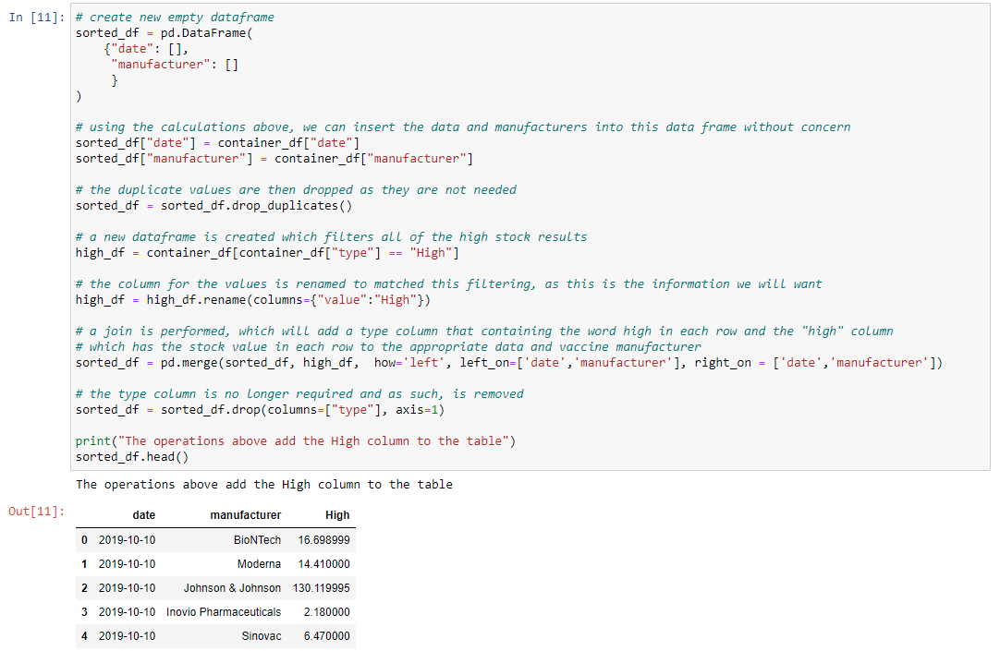
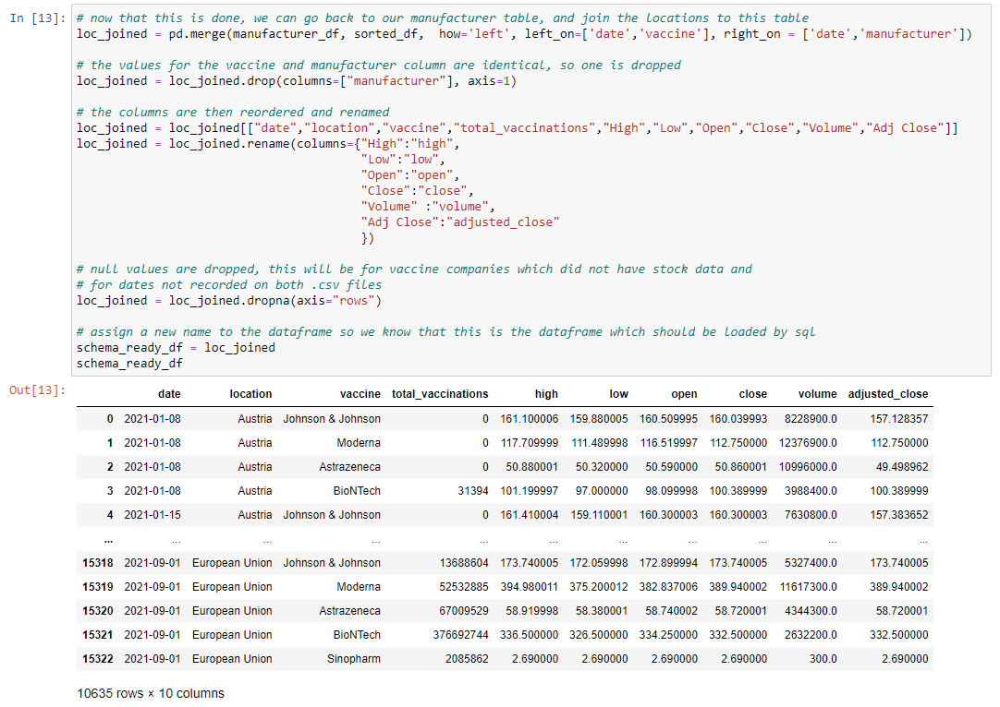

## Transform 

Now that we have established that both of our dates used the same format and who our mutual vaccine manufacturers are, we used the rename function to change the names of the vaccines in the manufacturer_df. 
We chose to rename them in the manufacturer_df and not the stocks_df as the vaccine names were easier to read. 

The challenge we faced in the stocks_df was that the names of each vaccine supplier and the stock value was stored in columns, as opposed to rows. 
We needed to divise a way to take the values from the columns, and insert them into rows. 
At which point we could join this information back with the manufacturer_df to show the total number of vaccines in a given location on a single row.

Our first step was to create a new list of lists, this list of lists was created through a nested loop. 
We extracted the name of each vaccine, stock type and value from their respectives columns on a row and added the date

Now that this was completed, our data was easier to work with. 
At this point, a mathematical check was conducted to see if each vaccine was present on each date in the dataset. 
To ensure no data was misplaced or lost during any further transformations. 

Now we could take this data where the stock type is stored in rows and move it back into columns which store the stock value. 

We began by placing all of the dates and manufactures into a new dataframe and filtering for one of our six stock stypes. 
This filtered dataframe would then be joined with our new empty dataframe. 
We ran the operation with a single stock value as a proof of concept. 

Now that we could see this achieved the desired result, we perform the operation with each of the stock types. 

To finish our transforming, we have to bring both of our dataframes, our stocks_df now named 'sorted_df' and the manufacturer_df. 

This was completed using a join and dropped both the duplicate rows as well as rows containing NaN values. 

Rows either contained NaN values due to: 

* The date ranges of both datasets not being mutual. 
* A vaccine not being present on both sources of data. 

We apprecaite that this drops a lot of data, however, we are only dropping data which would not be used in the analysis we anticipate our data to be used for. 

Ultimately, we are still left with over a year's worth of data for multiple vaccine manufacturers and feel this is sufficient. 
We could consider not dropping this data in future and leaving it to the analyist to make that decision - if they for example wanted to see vaccines produced in a country which weren't neccessarily tracked by stocks.
As this may have had an effect on the stocks of one of our vaccine manufacturers we do have recorded stock data for. 
For example, if both manufacturers were competing for a location, their stock prices may be effected by the other. 

Now that we have finished our transformation, we could now begin loading this data into SQL.
